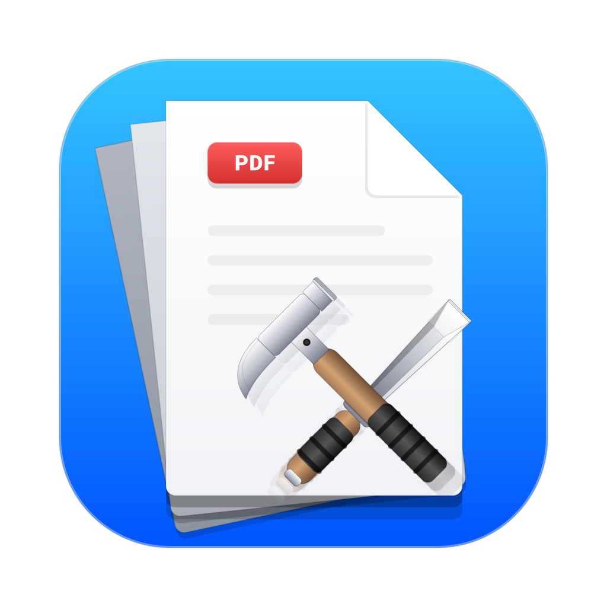

<div align="center">
  
  <h1>PDF Toolkit Desktop</h1>
  <p><b>A modern, privacy-first, cross-platform PDF manipulation and conversion suite.</b></p>

  [](#)
  [](#)
  [](#)
  [](#)
  [](#)
</div>

---

## Overview

**PDF Toolkit Desktop** is an enterprise-grade desktop application engineered for high-performance, offline PDF manipulation. Built on robust technologies like `pdf-lib`, `pdfjs-dist`, and `Electron`, it provides a seamless, native GUI experience without compromising on the advanced functionality demanded by power users.

Designed with an uncompromising stance on data sovereignty, PDF Toolkit operates **100% locally**. There is no cloud processing, no server uploads, no telemetry, and no user tracking. All operations—including password encryption, document signing, and complex conversions—are securely executed entirely on your local machine.

---

## Table of Contents

1. [Architecture Overview](#architecture-overview)
2. [Core Features & Interface](#core-features--interface)
3. [Security & Privacy](#security--privacy)
4. [Developer Onboarding](#developer-onboarding)
5. [Build & Distribution](#build--distribution)
6. [License](#license)

---

## Architecture Overview

PDF Toolkit strictly adheres to the Electron multi-process architecture, isolating the frontend presentation layer from the Node.js backend environment for enhanced security and performance.

### Technology Stack
* **Application Framework:** Electron `v30.0.1`
* **Presentation Layer:** React `v18`, Tailwind CSS `v4.3`, Framer Motion (for fluid, Apple-style animations)
* **State Management:** React Redux `@reduxjs/toolkit`
* **PDF Engines:** `pdf-lib` (Document Manipulation), `pdfjs-dist` (Canvas Rendering/Viewing)
* **Build Pipeline:** Vite, Electron Builder

*For a detailed look at the codebase structure and IPC design, please see [architecture.md](./docs/architecture.md).*

---

## Core Features & Interface

PDF Toolkit provides a comprehensive suite of offline tools wrapped in an elegant, frosted-glass UI inspired by native macOS design paradigms.

### Feature Suite
- **Merge & Split:** Combine multiple documents or extract specific page ranges effortlessly.
- **Conversions:** Convert `PDF ↔ Images` (PNG/JPG), `HTML → PDF` (with precise scale and paper margins), and `Excel → PDF`.
- **Security:** Encrypt and Password-Protect PDFs, or completely unlock and decrypt them.
- **Watermarking & Signing:** Type, draw, or upload cursive signatures and high-res watermarks with pixel-perfect visual parity and robust font support.
- **Manipulation:** Rotate documents and visually rearrange/delete pages using an interactive drag-and-drop grid.

---

## Security & Privacy

This application is built with a **Zero-Trust Local Execution** philosophy:
- **No Network Requests:** The app does not make outbound network requests (external fonts have been embedded locally).
- **In-Memory Processing:** Sensitive operations like PDF Decryption and PDF Encryption are performed strictly in memory using AES-256 (via `pdf-lib`).
- **No Temporary Files:** Operations process binary arrays directly to avoid writing unencrypted data to your disk.

---

## Developer Onboarding

### Prerequisites
- Node.js (v20+)
- npm or yarn

### Quick Start
```bash
# Clone the repository
git clone https://github.com/imshawan/pdf-toolkit-desktop.git
cd pdf-toolkit-desktop

# Install dependencies
npm install

# Start the local development server (Vite + Electron)
npm run dev
```

*For guidelines on committing code, creating pull requests, and adding new PDF tools, please see [CONTRIBUTING.md](./CONTRIBUTING.md).*

---

## Build & Distribution

To compile the application into a standalone executable (e.g., `.dmg`, `.exe`, `.AppImage`):

```bash
# Build the React production bundle and package the Electron app
npm run build
```
The compiled binaries will be exported to the `release/` directory.

---

## License

This project is licensed under the Apache License 2.0. See the `LICENSE` file for full details.
