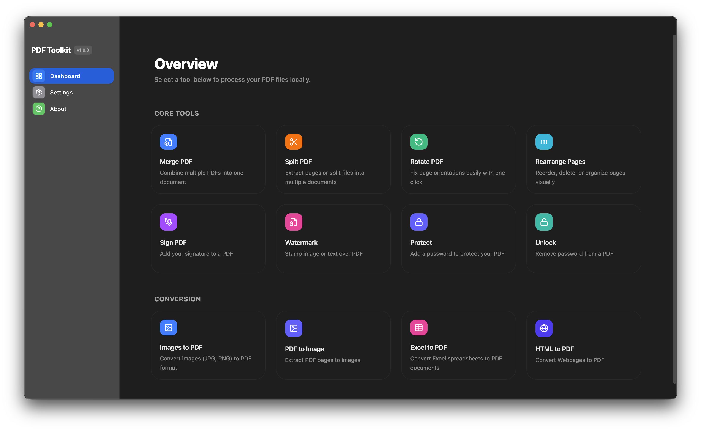
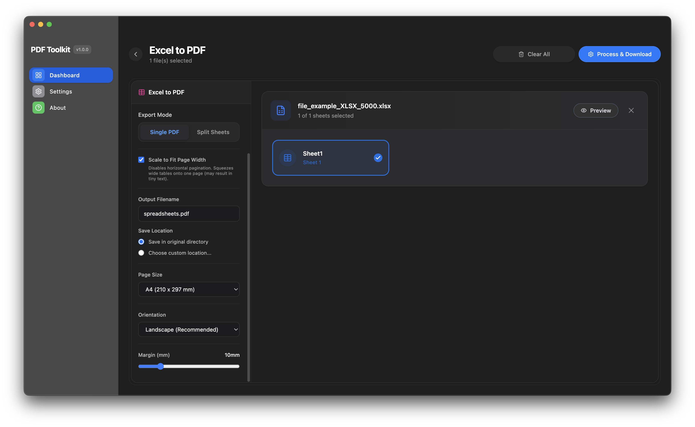
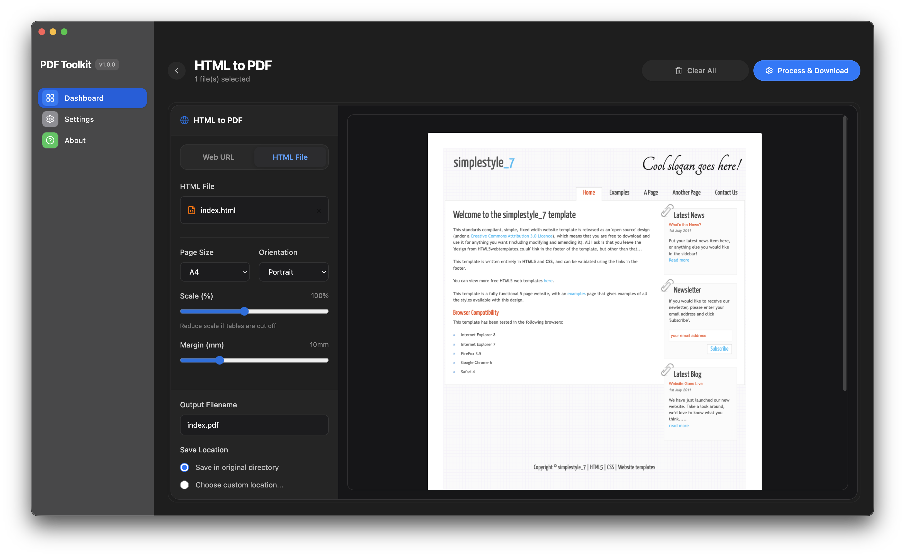
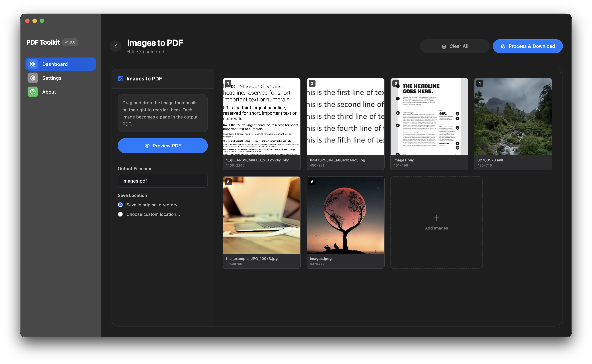
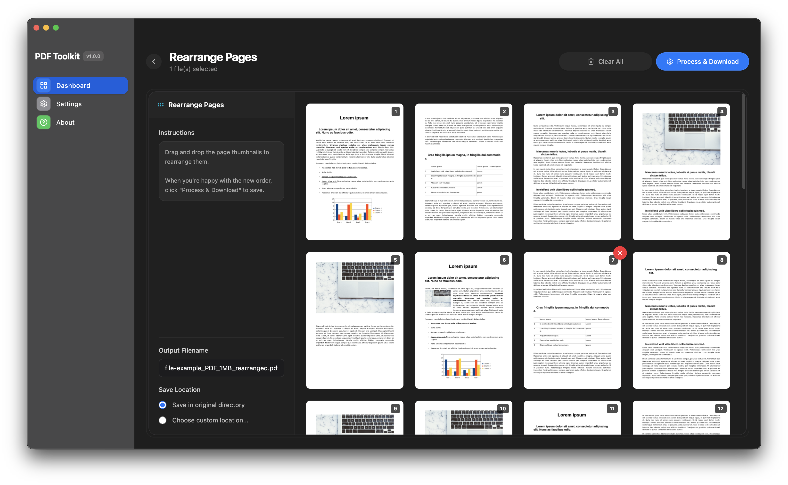
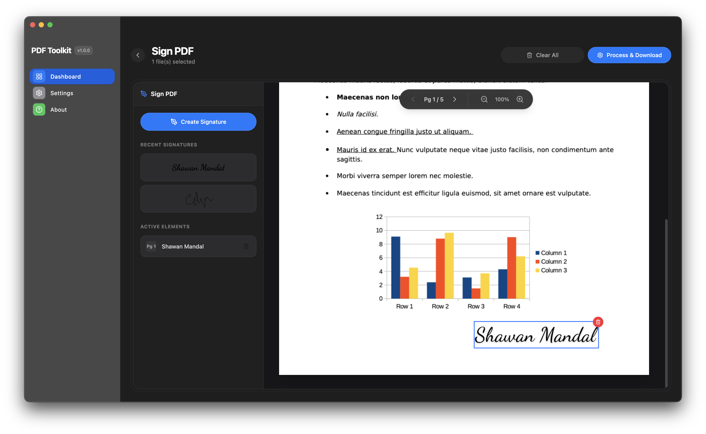
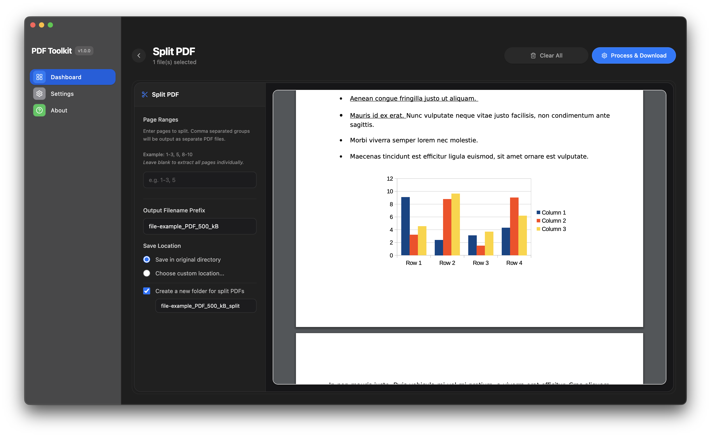
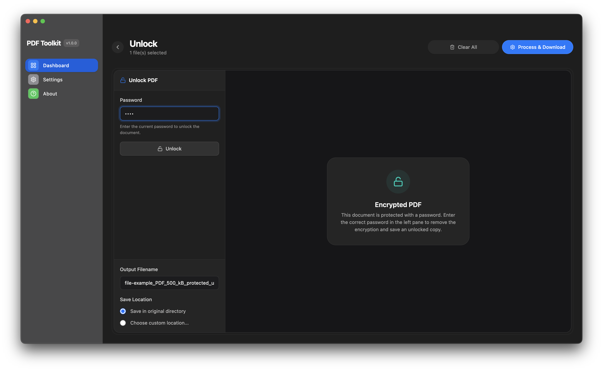

# App Screenshots

Below is a visual overview highlighting the native-styled interface and core capabilities of PDF Toolkit Desktop.

*Note: This gallery contains a selection of screenshots and does not depict every screen or tool available in the application.*

---

### Home Page

---

### Excel to PDF

---

### HTML to PDF

---

### Images to PDF

---

### Rearrange PDF

---

### Sign PDF

---

### Split PDF

---

### Unlock PDF

